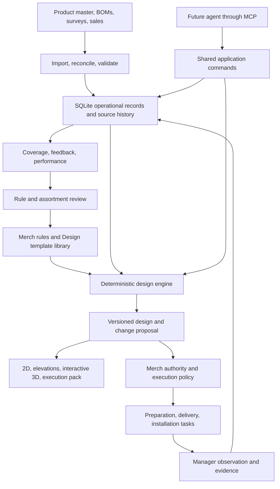

# Anatolia showroom management — foundation and delivery plan

Draft for working discussion · 7 September 2026

## 1. The outcome we are building

Build a system that can take a showroom brief and measured space, choose Anatolia's standard display systems, arrange them, assign suitable products, simulate the result, produce an implementation package, and keep its record aligned with the physical showroom. Routine designs should be possible without a designer creating each showroom manually.

The durable company asset is the combination of **product knowledge, reusable fixture and room standards, executable merchandising rules, and a reliable record of field changes**. The 3D interface makes that knowledge understandable and usable. An agent will later use the same capabilities to interpret objectives, compare alternatives, coordinate work, and propose improvements.

### Confirmed decisions from this discussion

- **Pilot:** APS Temporary Showroom.
- **Product classification:** Prime or Commercial positioning, with an independent Hit flag. A Prime product can also be a Hit.
- **Authority:** Merch has higher authority than showroom management.
- **Design capability:** the system must independently produce complete designs. Approval policy must not substitute for missing design capability.
- **Delivery approach:** deterministic rules first; agent judgment and MCP access built on the same foundation.
- **Display meaning:** waterfall means the angled, side-by-side triple-panel installation described by Erfan, including a wall-mounted version. It does not mean a countertop falling over an edge.

Proposed defaults still requiring a named owner: who publishes product classifications, who authorizes spending and physical work, the maximum routine-change budget, and which channels are used for work coordination. These do not prevent a local simulation or a proposal engine.

### Three connected design modes

| Mode | Input | Complete output |
|---|---|---|
| Record an existing showroom | Drawings, BOMs, photographs, field survey | A verified map of fixtures, display positions, material applications, condition, and unknowns |
| Refresh an existing showroom | Current state, launch/discontinuation or new brief, constraints | Product substitutions, moves, optional fixture changes, cost and coverage differences, tasks |
| Design a showroom from a shell | Measured envelope, doors/columns/services, budget, target range, standard library | Fixture selection and layout, circulation, room compositions, every product assignment, simulation, quantities and execution package |

Start with the first two modes on a bounded APS area. The third is a required milestone, not an indefinite future option.

## 2. What the repository gives us

This is a review of the present source code, generated datasets, existing documentation, asset inventory, and existing smoke checks. It is **not a fresh physical survey or a complete re-extraction of every original drawing and workbook**.

### Verified starting point

| Asset or behavior | Observed baseline | Reuse |
|---|---|---|
| Five showroom datasets | APS 174, Manisa 103, Ekinox 70, Ankara 60, Turkuaz 91 viewer records: **498 total** | Initial migration fixtures and comparative examples |
| Product references | **297 distinct nonempty product numbers in the runtime viewer** | Candidate catalog references, pending reconciliation with the product master |
| Current checks | `tools/check_showrooms.js` passes for all five showrooms | Preserve its UI reachability, selection, filtering, and showroom-switch coverage |
| Product imagery | 53 files in `From_website`, 66 in `assets/products` | Texture discovery and provisional product previews; filenames need identity mapping |
| APS reference material | Layout document, drawing PDF, BOM CSV/XLSX, 27 room photographs | Best starting point for a survey-backed pilot |
| Sliding assets | 49 files: 48 panel images and one rack mockup | First elevation and material preview |
| Launch example | Tuscano Rosso image and three videos in the launch folder | Demonstration narrative; this does not establish an actual launch date, SKU, stock, or classification |
| Existing app | Single HTML dashboard, generated data, custom SVG interaction | Useful reference and transitional viewer |

The previous proposal reports 528 workbook product-number rows and 318 distinct SKUs. Those are a different, previously reported measurement; they were not independently recounted here. The difference from 498/297 is a reconciliation task, not evidence that 30 installations are missing. Workbook rows, displayed records, physical pieces, and unique products are different units.

### Findings that should shape the redesign

1. **Two views can disagree.** Six products in APS's 120 × 280 sliding bank have different positions in the gallery and hardcoded sliding view. For example, Crystal Bianco `8500-0057-1` is Gallery position 12 versus sliding-view position 11; Lustra Onyx Sage `8500-0064-0` is 11 versus 12. Four more disagreements involve positions 19–22. Verify the real arrangement and generate both views from one assignment map.
2. **Display names need a controlled vocabulary.** The app and data document use a countertop meaning for waterfall. Adopt the user's definition, with separately named furniture edge details if needed.
3. **Fixed panel identity depends on array positions.** The gallery groups sequential pairs, while `fixedPanels()` has a separate 24-panel layout map. Front/back addressing and shared physical pieces must be explicit records. Do not infer bookmatch from a panel showing the same product on both sides.
4. **Product identity is too entangled with presentation.** Collection/color/material are partly inferred from names, sizes, and thickness. Retain those guesses as migration hints; approved catalog attributes must control actual design decisions.
5. **A row may cover several physical surfaces.** Examples include wall entries such as `1A·1C` or `2A·2B·2D`. Preserve the source row and map it to individual surfaces without multiplying procurement quantities accidentally.
6. **Plans have different confidence.** The non-APS registry explicitly says its coordinates are schematic percentages. APS documentation describes PDF-derived dimensions, which also need verification. Neither is automatically an as-built survey.
7. **The rack is an SVG mockup with image masks.** It supplies useful interaction ideas but no general 3D fixture geometry, movement, or collision model.
8. **The data pipeline is built for viewing.** Positional tuples omit much of the source provenance, quantities, operational notes, and separate planned/observed states needed for management.
9. **A showroom label such as Installed is not confirmation of every item.** Import each record with its own evidence and date.

Source anchors: [viewer product construction](</Users/erfan.tari/Projects/Showroom/Showroom_Main_repo/Showroom Manager.dc.html:1056>), [fixed panel map](</Users/erfan.tari/Projects/Showroom/Showroom_Main_repo/Showroom Manager.dc.html:1094>), [SVG rack](</Users/erfan.tari/Projects/Showroom/Showroom_Main_repo/Showroom Manager.dc.html:713>), [registry](/Users/erfan.tari/Projects/Showroom/Showroom_Main_repo/showrooms.js:1), [legacy importer](/Users/erfan.tari/Projects/Showroom/Showroom_Main_repo/tools/build_showroom_data.py:1), [previous proposal](</Users/erfan.tari/Projects/Showroom/Showroom_Main_repo/Showroom System Vision.md>).

## 3. Recommended system structure

Use one application with clear internal modules before considering separate services. Product imports, planning, rendering, field updates, and future MCP tools should share validated commands and record identities.

### Storage and interfaces

| Concern | Recommended home | Reason |
|---|---|---|
| Showroom operations, observations, placements, task state | **SQLite**, on the application host | Transactions, relationships, queryable history, reliable manager updates |
| Team data entry and exchange | CSV and Excel templates | Familiar handoff; import is previewed and validated |
| Executable rules | Versioned, schema-validated JSON or YAML packages | Explicit rule types and parameters; changes can be compared and tested |
| Rule editing for Merch | Form or spreadsheet adapter that generates a proposed rule revision | No need to write code or maintain competing rule files |
| Brand intent and judgment guidance | Markdown linked to rule and template IDs | Explains objectives, examples, tradeoffs, and exceptions |
| Photographs, textures, drawings, 3D models | Managed asset directory initially; object storage later | Keep binaries outside database rows; records carry checksums and references |
| Web views and scene files | Generated JSON projections | All views point to the same data revision |
| Source code, schemas, templates, rule versions | Git | Reviewable implementation and configuration history |

**One authority per field.** If an ERP/PIM owns SKU specifications, the showroom database stores an imported, attributed copy. Merch owns positioning, Hit campaigns, and showroom range requirements. Design owns fixture capabilities and geometry standards. Managers own their observations of reality. Imports cannot silently overwrite another owner's facts.

CSV is appropriate for a local design sandbox, but a shared mutable CSV ledger would make field updates and conflicting edits needlessly fragile. Use SQLite as canonical operational storage before the first multi-user field workflow. Its suitability depends on the deployment and write workload: SQLite allows one writer at a time; remote users should call the application, with its database on local disk. Move to PostgreSQL if measured contention, multiple application writers/replicas, or availability requirements justify it. [SQLite deployment guidance](https://www.sqlite.org/whentouse.html), [network filesystem considerations](https://www.sqlite.org/useovernet.html).

The existing static viewer can consume generated snapshots during migration. Operational forms need an authenticated backend. Publishing, hosting location, and external connections are separate deployment decisions; this plan does not change them.

### Implementation direction

- Python domain package for imports, validation, rules, planning, quantities, and task generation; typed schemas and SQLite migrations.
- Browser UI with a maintained component structure; Three.js for the 3D layer. Choose the UI framework when implementation begins, based on maintainability and the team's skills.
- A small HTTP API and a CLI calling the same commands. MCP is an additional adapter later.
- One background worker for scheduled imports, change evaluation, and notification delivery. A durable task table and delivery outbox are sufficient initially.
- Authenticated roles: Merch, showroom manager, product owner, design-standard maintainer, logistics/installer, viewer. Scope manager access to their showrooms.
- Backups and a demonstrated restore before operational go-live. An audit table gives application history; it is not automatically tamper-proof or a complete backup.

## 4. The domain model

### Product hierarchy

**Collection → design/color → sellable SKU → material face/asset → physical sample or installed piece when tracked.**

A design/color groups related variants; the SKU specifies the actual finish, thickness, dimensions, and orderable item. Keep collection and design separate so a finish can be discontinued while the rest of the design remains active. Use a separate group for a coordinated color series such as Architeq; merchandising groups need not be identical to commercial collections.

Prime/Commercial usually starts at design/color level, with explicit SKU or market overrides where justified. Hit is a separate campaign/priority record with scope and effective dates. Do not infer either from a product name or sales rank without an approved policy.

### Space hierarchy

**Showroom → level → zone → fixture instance → component → surface/slot → material assignment.**

- A fixture template describes a reusable object; an instance is one actual object in one showroom.
- A slot is a discrete assignable position. A floor or wall is a surface polygon that may hold an installation assembly with many pieces.
- A fixed panel has independently addressable A/B sides. Whether they share a physical slab is a separate construction attribute.
- A waterfall has three linked panels and an installation mode. Its grouping is not inferred from the number of BOM rows.
- A tower is a cabinet of individual sample positions with capacities and sample states; one tower BOM row is not one represented product.
- A table, basin, or counter is an assembly with top, edges, sides, cutouts, supports, and material components.
- Chairs, TV screens, appliances, and decorative props are scene objects. They count as product exposure only if they have an actual Anatolia material application.

Use immutable internal IDs plus human-readable addresses, for example `APS/GF/R4/SLIDING-A/P07/FRONT`. Moving an object changes its location, not its identity. Keep legacy labels as aliases and maintain a separate explicit display order.

### Core records and delivery order

| Records | Essential information | First needed |
|---|---|---|
| Source documents, import batches, source rows | File revision/hash, sheet/page/row, original value, disposition, confidence | Foundation |
| Collections, designs, SKUs, aliases | Stable identity, finish, nominal/actual dimensions, thickness, status and dates | Foundation |
| Application eligibility | SKU/finish + use + conditions + evidence; allowed, forbidden, unknown | First planner |
| Merch profiles and target assortment | Prime/Commercial, Hit, market, dates, required coverage, duplication preferences | First planner |
| Showrooms, levels, zones | Envelope, units, entrances, services, immutable obstacles, visibility positions | Foundation |
| Fixture templates and instances | Dimensions, surfaces, capacities, movement, dependencies, geometry revision | Simulation |
| Slots/surfaces and adjacency | Mounting side, sequence, grouping, accepted formats, real polygon/transform | Foundation |
| Material applications and assemblies | SKU, face identity, orientation, area/pieces, linked surfaces, cut detail | Simulation and quantities |
| Plan revisions and assignments | Brief, base-state revision, input/rule/template hashes, proposed and released assignments | First planner |
| Observations and accepted installation history | What/where/when, observer, evidence, confidence, superseded record | Existing-state pilot |
| Change sets, tasks, dependencies, reservations | Actions, owner, due date, prerequisites, quantities, lifecycle, source plan | Operational loop |
| Rule exceptions | Scope, reason, owner, validity period, supersession | First planner |
| Feedback and sales snapshots | SKU/design, location, timestamp, context, source, aggregation definition | Feedback and sales phase |
| Domain events and delivery outbox | Event ID, actor, revision, cause, idempotency key, delivery state | Operational loop |

These are conceptual entities, not a requirement to build all tables before testing a panel assignment.

### Separate the three time-dependent truths

1. **Proposed design:** what a scenario says should change.
2. **Released design:** the currently authorized target for work.
3. **Observed installation:** what people report and verify is physically present.

An approved or shipped item must never appear as installed automatically. A manager can report an actual change even if it violates a Merch rule: record the fact, show the mismatch, and route reconciliation. Rejecting the observation would make the system less truthful.

Use effective time and recorded time. A late report from yesterday must not silently replace a newer confirmed arrangement. Distinguish unknown, empty, reserved, damaged, inaccessible, and occupied positions. A launch proposal may target a reserved future slot without pretending it is currently empty.

## 5. Rules that encode Anatolia's design judgment

### Three rule classes

- **Hard constraints:** physical compatibility, protected areas, approved use, capacity, required assembly relationships, authoritative locks, and any merchandising requirements explicitly declared mandatory.
- **Preferences:** visibility, Prime placement, color harmony, coverage breadth, finish variety, replacement effort, and cost within allowed limits.
- **Templates:** approved ways to compose a room or display group. Examples: fireplace lounge, vanity scene, meeting room, a light-to-dark color library, or a three-panel waterfall.

Never express an absolute prohibition as a large negative score. A discontinued SKU cannot become eligible simply because another preference outweighs its penalty. Unknown technical eligibility is not equivalent to allowed. Existing installations remain recorded even when new placement is prohibited.

### Initial rule backlog

| ID | Proposed behavior | Class / owner |
|---|---|---|
| FIT-01 | Match usable mounting area, actual dimensions, thickness, mass/load limit, orientation and fixing method | Hard; Design |
| USE-01 | Live floor, wet area, fireplace and fabricated furniture require eligibility for that exact application | Hard; product technical owner + Design |
| LIFE-01 | Exclude ineligible lifecycle/market/date combinations from new assignments | Hard; product owner |
| SPACE-01 | Respect measured envelope, fixed services, protected paths, clearance and movement envelopes | Hard; Design |
| AUTH-01 | Preserve Merch locks and active scoped exceptions; managers cannot override their authority | Hard; Merch |
| HIT-01 | Favor Hit products on explicitly marked entry-visible surfaces | Preference or scoped mandate; Merch |
| PRIME-01 | Favor Prime in live scenes and front/open-view positions of sliding systems | Preference; Merch |
| COMM-01 | Favor suitable Commercial variants on live floors when technically eligible and consistent with the room palette | Preference; Merch |
| COV-01 | Cover the showroom's approved target assortment before adding low-value repetitions | Required targets plus preference; Merch |
| COV-02 | Reward another finish/application when a design repeats; cap redundant exposure | Preference; Merch |
| COLOR-01 | Keep a specified color series contiguous and in its approved warm/neutral light-to-dark sequence | Constraint or preference by series; Merch + Design |
| ASSEMBLY-01 | Preserve verified bookmatch sets, panel groups, furniture components and installation dependencies | Hard; Design |
| VIS-01 | Distinguish visible while closed, visible when opened, and hidden storage faces | Data + preference; Merch + Design |
| COST-01 | Keep permanent surfaces locked in a routine refresh; changing them requires an explicit renovation scope | Hard scope; Merch |
| CHANGE-01 | Minimize unnecessary moves and retain a suitable established arrangement | Preference; Merch |
| READY-01 | Released work must account for availability, lead time and reservations; scenarios may show pending supply | Release condition; logistics |
| RESERVE-01 | Allow deliberate launch capacity in suitable fixtures when brief and coverage permit | Preference; Merch |

The APS note about 12 mm slabs on outer rails is a **candidate local rule**. Confirm the fixture's actual mechanical restriction and scope it to that fixture/version; do not universalize a note from one showroom.

### What “show everything” should mean

Define an explicit target set for each showroom: required designs/colors, finishes, format classes, and application demonstrations. A compact dealer showroom cannot necessarily hold every SKU. Give the planner required coverage, desirable coverage, and a permitted maximum fixture footprint.

Report distinct dimensions separately: design coverage, finish coverage, format coverage, application coverage, and visible versus stored sample coverage. Denominators must be the versioned eligible target assortment, not whatever rows happen to exist. A 30 cm chip and a front-position full slab are two different kinds of exposure.

If mandatory requirements exceed capacity, return the shortage and smallest useful remedy: add a fixture, change a template, expand the scope, or request a Merch range decision. Never silently omit a mandatory product.

### Color and composition

For the first release, Merch/Design supplies a deliberate rank for every color series and its grouping mode: light→dark, warm-light→warm-dark followed by neutral-light→neutral-dark, or another approved sequence. Architeq is a suitable example if its confirmed range is supplied; do not invent its colors.

Later, measured color can suggest an ordering. Texture photographs alone are not calibrated color measurements; finish, veins and lighting also affect perception. Preserve manual approved ranking, vein direction, visual movement and accent roles rather than reducing all appearance to a single lightness value.

For rooms, use a small composition grammar: focal surface, supporting surfaces, floor, furniture material, accents, and neutral space. Define allowed material pairings, maximum competing focal patterns, alignment rules, and lighting presets through reference examples. This lets the system compose complete scenes within Anatolia's standard vocabulary.

### A rule's record

Every rule needs an ID, version, owner, purpose, scope, effective dates, strength, a recognized rule type with typed parameters, required input fields, explanation text, source reference, and positive/negative examples. An exception needs the same scope and an expiry or review condition.

CSV rows and forms can edit parameters. Markdown can explain why the rule exists and guide an agent. Arbitrary prose, spreadsheet formulas, or model-generated code do not become executable constraints automatically. They become a proposed rule revision with validation and regression examples.

## 6. How the deterministic design engine works

### Existing-layout product assignment

1. Freeze the brief, planning date, observed/released revisions, catalog, availability snapshot, active rules and templates.
2. Preserve locks, identify uncertain records and group linked surfaces/assemblies.
3. Generate compatible SKU/assembly candidates per slot. Record exclusion reasons.
4. Apply mandatory constraints and test whether a feasible assignment exists.
5. Optimize the declared preference order: required coverage; strategic exposure; collection/finish breadth and approved compositions; change cost and disruption; stable tie-breaking. Merch can publish different objective profiles for launch versus renovation.
6. Solve placement and required ordering together. Sorting afterward could break an end-rail constraint, linked panel group, or visibility requirement.
7. Validate the complete output independently, including any fields not represented by the optimizer.
8. Produce the proposal, coverage changes, explanations, unfilled requirements, supply dependencies, quantities and task preview.

Use a small deterministic baseline to make the first examples understandable, then a constraint model such as OR-Tools CP-SAT for combinations of coverage, adjacency, linked assignments and budgets. A simple linear assignment solver handles a narrower assignment problem; it does not directly model the full showroom rule set. This is an architectural inference from the required relationships, not a benchmark result. [SciPy assignment definition](https://docs.scipy.org/doc/scipy/reference/generated/scipy.optimize.linear_sum_assignment.html).

Do not promise exact optimal solutions in milliseconds. CP-SAT distinguishes optimal, feasible, infeasible, invalid and unknown outcomes; feasible does not mean optimal. Use integer/scaled parameters, store result status and objective bounds, and measure performance on our fixtures. [OR-Tools CP-SAT documentation](https://developers.google.com/optimization/cp/cp_solver).

For reproducibility, pin inputs and software versions, sort candidates, control seeds and worker configuration, prefer a deterministic work limit for repeatable tests, and use a stable final tie-break. Keep the accepted result immutable. Wall-clock timeouts and different solver versions may change results; only promise repeatability that the regression suite actually demonstrates.

### Complete layout generation

The blank-shell engine needs a defined search space:

1. Read the brief: target range, required experiences, fixture catalog, dimensions, services, entrances, budget and permitted construction scope.
2. Generate candidate fixture counts and approved zone/room templates sufficient for the assortment.
3. Generate candidate positions and rotations from wall anchors, a declared placement grid, and approved layout patterns. Keep fixed architecture and services as constraints.
4. Check footprints, doors, motion envelopes and circulation connectivity, including operating positions of sliding and rotating panels.
5. Assign products and evaluate the combined spatial/merchandising result. If the assortment cannot fit, revise fixture/template choices and repeat within a bounded search.
6. Validate precise geometry after grid/candidate solving. Feed conflicts back into the candidate set; block any invalid proposal from release.
7. Produce a small number of complete alternatives under declared briefs, such as minimum intervention and stronger launch exposure. Explain tradeoffs with the same metrics.

This staged search is a practical first implementation, not a claim of global optimality over every conceivable room design. Design's upfront job is to define valid components, composition patterns and physical constraints; the system performs each routine layout and product assignment itself.

## 7. Changes, field truth and work coordination

### Change lifecycle

`Detected change → evaluated impact → complete design proposal → release under Merch policy → reserve/prepare → dispatch → receive → install → verify → close`

Design generation can run automatically. Releasing spending or physical work follows an explicit Merch-controlled policy. Routine eligible changes can eventually be released automatically within that policy; unusual cost, renovation, missing technical data or policy conflicts are routed as exceptions. This preserves autonomous design while keeping business authority explicit.

A manager can request a redesign, propose substitutions and report actual changes. Merch can lock a display or override the proposal. A manager's conflicting field report remains a valid observation and triggers reconciliation; it does not rewrite the Merch rulebook.

### Launch/discontinuation example

Use the Tuscano Rosso media as a **scenario**, after resolving the commercial name, SKU variants, dates, classification and availability with the product owner.

- A new launch record triggers impact analysis across eligible showrooms.
- APS's engine first evaluates empty/reserved positions and low-value repeated exposure, considering a different finish of an already represented design.
- It selects a valid complete arrangement and explains what gains visibility, what moves, and what coverage would be lost.
- It produces grouped tasks and quantities, including preservation or relocation of displaced material.
- Supply and installation confirmations update their own states. The showroom becomes current only after field evidence is accepted.

For a discontinued SKU, immediately prohibit new placements according to the lifecycle policy, identify all affected locations, and propose replacements. Physical removal timing depends on availability, permanence, commercial urgency and Merch policy. A discontinued floor is not automatically a demolition order.

### Operational behavior to build deliberately

- **Task dependencies:** product approval → sample/slab preparation → labels → shipping → receipt → installation → evidence.
- **Movement chains:** if A moves into B's occupied position, include a staging position or ordered sequence. A material cannot occupy two places at once unless a second piece is supplied.
- **Duplicate handling:** repeated imports or retried events create one logical change/task, identified by event/change/action keys.
- **Stale proposal handling:** revalidate its base state, rules and stock before release. Concurrent proposals cannot reserve the same physical stock twice.
- **Plan supersession:** explicitly cancel or reconcile obsolete unstarted work. Delivered or installed work needs a compensating action, not deleted history.
- **Exceptions:** backorder, damage, wrong finish, inaccessible fixture, blocked task, rejection, partial delivery, and missing evidence.
- **Notifications:** send actionable changes, due/overdue escalations and required decisions to the assigned role. Batch routine updates; do not repeat unchanged alerts. Channel, recipients and cadence remain configuration.

### Quantities and fabrication

Count physical pieces separately from displayed faces. Estimate net surface demand, cutting loss and repair spares separately, then account for stock/remnants and round the order to pack or slab units. Preserve purchase size, finished cut size and orientation.

Area-based tile estimates are useful for an early budget but do not prove slab cutting feasibility. Bookmatch requires verified compatible faces and orientation; furniture needs cutouts, edge details, supports and fabrication drawings. Track output maturity as **estimate**, **layout-checked**, or **fabrication-ready**. Reusable verified cutting recipes can automate standard furniture later; novel constructions require a new standard or exception resolution.

## 8. Simulation and the working interface

The user should be able to select a fixture or product in 2D, elevation, 3D or a list and reach the same record. Views show **Current**, **Released**, and **Scenario** with a clear revision/date and verification state.

Build three complementary views early:

1. **Plan:** arrangement, paths, floor fields, capacities, and mismatches.
2. **Elevation/display sequence:** full product faces, front/back, ordering and finish comparisons.
3. **Interactive 3D:** room composition, material scale, entry sightlines, sliding panels and the rotating floor demonstration.

A restrained brand presentation should support orbit/walk controls, room isolation, walls hidden for inspection, product search, material swapping in scenarios, camera bookmarks, and before/after comparisons. Provide obvious front/back and open/close controls for touch users as well as desktop controls.

For a first measured APS bay, use procedural fixture geometry with existing textures. Add detailed furniture and physically based materials as approved assets arrive. Keep approximate assets visibly identified in the inspector. Color textures and material maps require correct color-space handling; glTF is a practical runtime model exchange format. [Three.js color management](https://threejs.org/manual/en/color-management.html), [GLTFLoader](https://threejs.org/docs/pages/GLTFLoader.html).

The 3D renderer must not own product assignment. It receives a generated scene manifest tied to a plan revision. glTF is a presentation asset format, not the authoritative fixture database or a guaranteed CAD round-trip. Preserve geometry source, IDs, units and validation when importing revised Design assets.

See [Simulation starter specification](</Users/erfan.tari/Projects/Showroom/Showroom_Main_repo/docs/planning/Simulation_Starter_Spec.md>) for all seven fixture contracts, material inputs, scene fields and acceptance checks.

## 9. Feedback, sales and future agents

### Feedback without slowing the manager

Select a product in the simulation, scan a fixture QR, or use a simple product lookup. Pre-fill showroom, slot, SKU, finish and current exposure. Capture interest, objection or request; a short reason such as color, pattern, finish, format, price or availability; and optional notes. Allow design-level feedback when the exact SKU is unknown and record that uncertainty.

Keep customer identity optional and avoid requiring personal details for merchandising feedback. Include whether the customer saw a full installation, sample or image. Report observation counts and collection coverage so one enthusiastic manager's entries do not masquerade as representative customer demand.

### Sales as evidence, then a controlled design input

Import period, SKU, channel/showroom/region, quantity unit, currency, returns, availability and source. Distinguish showroom-attributed sales from regional or company-wide sales. Normalize comparisons for availability and exposure duration where possible. A visibility score is a model of potential exposure, not measured footfall or proof that display caused a sale.

Begin with a bounded sales modifier and hold an exploration allocation for launches. Compare changes over stable review periods and use minimum-duration/cooldown rules to prevent weekly rearrangement. Merch publishes any resulting priority policy. Agent recommendations can cite sales and feedback; they should not claim causal uplift from a simple before/after comparison.

### Agent capability and MCP contract

Expose domain commands such as `get_showroom`, `get_catalog`, `validate_brief`, `design_showroom`, `compare_plans`, `explain_assignment`, `estimate_changes`, `submit_proposal`, `record_observation`, `record_feedback` and `get_tasks`. MCP tools can declare input/output schemas; enforce authorization and validation in the application as well. [MCP tool specification](https://modelcontextprotocol.io/specification/2025-11-25/server/tools).

The agent receives the Merch brief, rulebook explanations, permitted template library, current state and tool results. It may choose an objective profile, request alternative complete layouts, evaluate aesthetic tradeoffs, propose a scoped exception or draft a new rule. Any direct assignment it suggests passes the same validator and becomes a traceable proposal.

Write commands need actor/role, showroom scope, base revision and idempotency key. Separate generating a scenario, releasing a plan, recording physical work and notifying people. Document permissions in Markdown, but enforce them in code. Treat imported notes and customer text as evidence rather than instructions.

Progression: explain/query → generate and compare complete designs → draft coordination work → execute predefined routine policies → broader autonomy after evaluated performance. Keep the same services and records throughout.

For the eventual command center, publish stable event contracts such as `product.status_changed`, `showroom.plan_released`, `showroom.installation_confirmed` and `showroom.exception_opened`, with IDs, timestamps, schema versions and provenance. Start with an outbox and API; introduce a company event platform only when real integrations require it.

## 10. Phased delivery with acceptance gates

Effort ranges below are **initial engineering estimates**, not delivery commitments. They assume responsive Merch/Design/product owners and one or two focused builders. Survey, asset preparation, procurement and installation lead times are additional. Re-estimate after Phase 0; do not turn uncertainty into fixed dates.

| Phase | Deliverable | Exit gate | Indicative engineering effort |
|---|---|---|---|
| 0 — APS brief and standards | Glossary, source register, pilot boundary, minimum schema, initial rule examples, measured asset requirements | Merch confirms brief; every pilot input is attributed or explicitly unknown | 1–2 person-weeks |
| 1 — Existing-state model and first simulation | Canonical APS pilot slots/observations; 2D + elevation + basic 3D from one manifest | Manager verifies pilot mapping; all views agree; unknowns cannot masquerade as verified | 2–4 person-weeks |
| 2 — Deterministic refresh | Full product assignment for fixed pilot fixtures, coverage checks, launch/discontinue scenarios, explanations and quantity estimate | Agreed cases pass, conflicts are explicit, repeatability demonstrated | 2–4 person-weeks |
| 3 — Operational loop | Merch authority, field updates, tasks/dependencies, evidence, backups, controlled notifications | One real change goes from proposal through verified installation; repeated events create no duplicate work | 3–5 person-weeks |
| 4 — Complete autonomous design | Brief-to-layout engine, fixture counts, room templates, product allocation, complete 3D and implementation pack | A measured shell yields a complete valid design without manual positioning or product assignment | 4–8 person-weeks |
| 5 — Multi-showroom learning | Onboard second showroom through templates; feedback; sales adapter and governed weighting | Second showroom needs data/configuration rather than bespoke presentation code; metrics have clear denominators | 2–4 person-weeks |
| 6 — Agent operation and command center interface | MCP, judgment guidance, agent evaluations, event contracts, bounded execution policy | Agent reaches the same validated outcomes and cannot bypass Merch permissions | 2–4 person-weeks |

Some module development can overlap after contracts stabilize. Total listed effort is roughly **16–31 person-weeks**; the upper end is plausible if fixture geometry, catalog identity and rule definitions need substantial rebuilding. A useful APS simulation and constrained refresh arrive well before the complete program.

**Pilot boundary:** first reconcile the complete APS source inventory sufficiently to evaluate showroom-wide exposure, then field-verify a bounded demonstration area: one sliding bank, a color-series run, representative fixed A/B faces, and one live scene. Build the seven fixture types in a separate labeled template test scene. Restrict initial physical recommendations to verified eligible positions. Expand the APS verified boundary progressively.

Do not require all five legacy showrooms to be perfect before proving one complete loop. Preserve all legacy source records during migration; resolve or quarantine disagreements rather than forcing row counts to match.

## 11. Acceptance scenarios and measures

| Scenario | Required result |
|---|---|
| Same input snapshot repeated | Same accepted semantic plan in the pinned test environment; run metadata can differ |
| New Hit + Prime product | Appropriate entry/front/live visibility within compatibility and budget constraints |
| No feasible slot | Explicit capacity/compatibility conflict; no fabricated location or silent omission |
| Discontinued finish only | All affected SKU placements found; other active finishes remain eligible |
| Extra capacity | Prefer missing target coverage, then useful finish/application diversity or deliberate reserve |
| Color series | Approved grouping/order survives end-slot, visibility and locked-position requirements |
| Fixed double-sided panel | Correct A/B identity and quantities across every view; shared pieces not counted twice |
| Rotating panel | Correct vertical-to-floor pose and required free space across the movement |
| Manager reports a noncompliant swap | Reality recorded, Merch mismatch shown, released target preserved |
| Two concurrent edits or stock claims | Conflict detected; no silent overwrite or double reservation |
| Partial shipment or retry | Correct remaining work; no duplicate task or installation confirmation |
| Empty-shell design | Fixture counts/layout, circulation, products, all required components and execution estimate generated together |
| New showroom | Standard imports and templates work without a new showroom-specific UI branch |
| Agent attempts an unauthorized release | Service rejects it while allowing permitted reading/design proposals |

Proposed pilot measures: all pilot positions mapped or explicitly marked unknown; zero unresolved hard violations in released work; every imported pilot record has source provenance; every proposed move has an explanation; all completed changes have confirmation; manager can record a basic observation or feedback within about one minute in usability trials. Track coverage gain, accepted proposals, rule exceptions, moves/cost per refresh, task completion delay and time since last verification. These are targets to validate, not current achievements.

## 12. Immediate action and coordination

The next concrete build should be **APS Simulation Template 0.1**, driven by an agreed slot/scene schema, alongside the initial product/rule reconciliation. It should already demonstrate current-versus-scenario switching and product selection tied to stable records. That gives Merch and Design something visible against which to define standards.

The detailed owner checklists, material requests, ten-day kickoff and unresolved decisions are in [Team readiness and decisions](</Users/erfan.tari/Projects/Showroom/Showroom_Main_repo/docs/planning/Team_Readiness_and_Decisions.md>). Together with the [Simulation starter specification](</Users/erfan.tari/Projects/Showroom/Showroom_Main_repo/docs/planning/Simulation_Starter_Spec.md>), these form the planning package for the next implementation task.

### Coverage of the original requirements

| Requirement | Planned capability |
|---|---|
| Existing showroom simulation | Evidence-backed model, all seven fixture types, 2D/elevation/3D |
| A — Material coverage | Explicit target assortment, application/finish coverage and suitability rules |
| B — Prime, Commercial, Hit | Separate positioning/Hit records, scoped visibility and use rules |
| C — Color adjacency | Approved color-series grouping, rank and composition templates |
| D — Synchronize/redesign | Lifecycle impact analysis, redundancy management, scenarios and versioned changes |
| E — Monitor events | Event evaluation, task dependencies, confirmation and actionable notifications |
| F — Beautiful interactive simulation | Shared scene manifest, branded interface, material scale and fixture motion |
| G — Other systems and sales | Attributed imports, bounded sales weighting and stable event/API contracts |
| H — Customer feedback | Selection/QR-based capture linked to product, finish, place and time |
| I — Deterministic then agent-driven | Shared design/validation commands, rule packages and MCP judgment workflow |
| J — Manager updates | Truthful field observations and change requests under Merch authority |
| End-to-end autonomous design | Required shell-to-complete-design milestone with no manual layout/assignment step |

### Review boundaries

Existing application behavior was inspected and its current smoke checks passed. No production app behavior, product classification, installed arrangement, deployment, external message, or source workbook was changed in preparing this plan. The previous untracked vision document was preserved. Technical links support the tool/deployment choices; merchandising rules, effort ranges and acceptance targets above are proposals for Anatolia, not claims from those sources.
